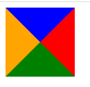

# 有趣的语法

## 画一个三角形

- ### 使用Border

    #### 前言

    使用css绘制边框的时候会出现“对角切分”效应，譬如下面的代码

    ```css
    .box{
        height: 100px;
        width: 100px;
        border-left:50px solid red;
        border-top: 50px solid blue;
        border-right: 50px solid orange;
        border-bottom: 50px solid green;
    }
    ```

    这样的`box`会变成这样：

    

    因此如果将整个`div`的长宽都设置为0

    ```css
    .box{
        height: 0px;
        width: 0px;
        border-top: 50px solid blue;
        border-right: 50px solid red;
        border-bottom: 50px solid green;
        border-left: 50px solid orange;
    }
    ```

    将会变成这样：

    
   
    以此类推如果要绘制出一个三角形，只需要将不需要的部分设置参数为`transport`就可以咯～

    ```css
    .box{
        height: 0px;
        width: 0px;
        border-top: 50px solid transparent;
        border-right: 50px solid transparent;
        border-bottom: 50px solid transparent;
        border-left: 50px solid orange;
    }
    ```

    

- ### 使用遮罩
    css中有一个属性`clip-path`用于设置遮罩，属性值可以为以下几种图形
    - 使用矩形`inset()`

        [详细用法点击这里](https://developer.mozilla.org/en-US/docs/Web/CSS/basic-shape/inset)

    - 使用圆形`circle()`
    
        [详细用法点击这里](https://developer.mozilla.org/en-US/docs/Web/CSS/basic-shape/circle)

    - 使用椭圆形`ellipse()`
    
        [详细用法点击这里](https://developer.mozilla.org/en-US/docs/Web/CSS/basic-shape/ellipse)
    
    - 使用多边形`polygon()`（通过这个方法可以实现绘制一个三角形）
        ```css
        .box{
            height: 100px;
            width: 100px;
            background-color: orange;
            clip-path: polygon(0 0,100px 50px,0 100px);
        }
        ```
    其实还有其它遮罩方法，[详细可以点击这里查看](https://developer.mozilla.org/zh-CN/docs/Web/CSS/clip-path)
    