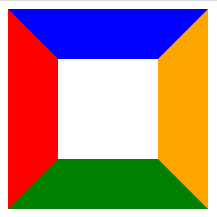
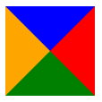

# 有趣的语法

## 画一个三角形

- ### 使用Border

    #### 前言

    使用css绘制边框的时候会出现“对角切分”效应，譬如下面的代码

    ```css
    .box{
        height: 100px;
        width: 100px;
        border-left:50px solid red;
        border-top: 50px solid blue;
        border-right: 50px solid orange;
        border-bottom: 50px solid green;
    }
    ```

    这样的`box`会变成这样：

    

    因此如果将整个`div`的长宽都设置为0

    ```css
    .box{
        height: 0px;
        width: 0px;
        border-top: 50px solid blue;
        border-right: 50px solid red;
        border-bottom: 50px solid green;
        border-left: 50px solid orange;
    }
    ```

  将会变成这样：

  